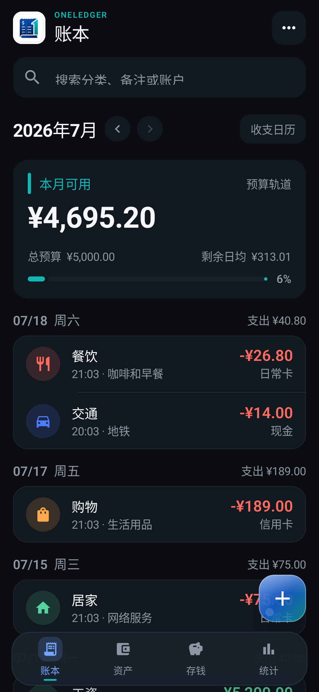
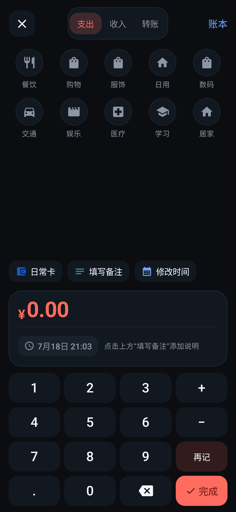
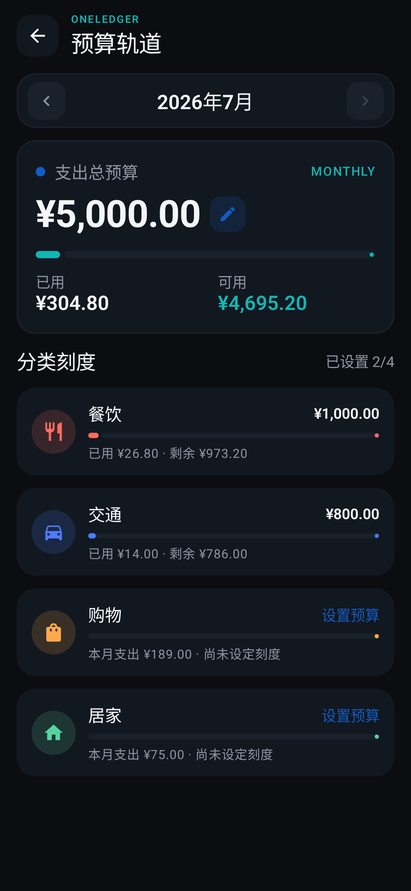
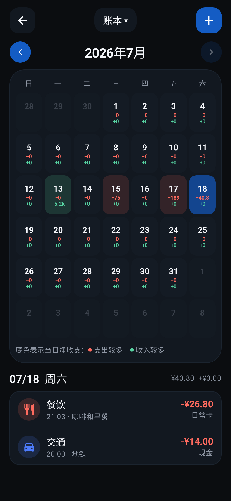
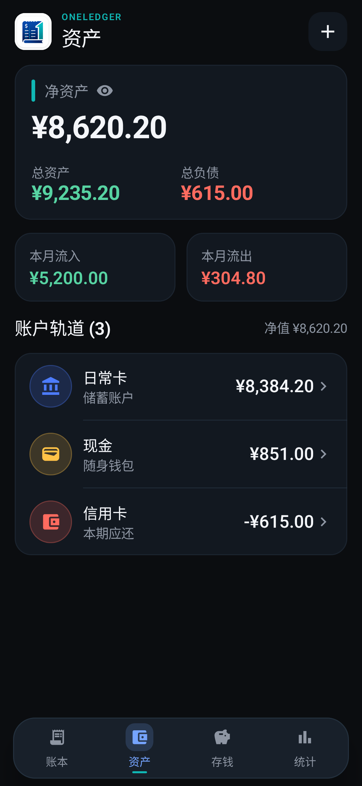
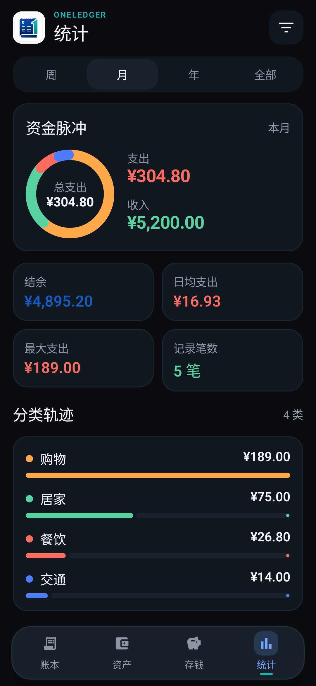

# OneLedger

OneLedger 是一款本地优先的 Android 个人记账应用，目前处于 v0.1 本地 MVP 阶段。当前聚焦四件事：看账、记账、看资产、看趋势；数据默认只保存在设备的 Room/SQLite 数据库中，不要求登录或联网。

## 界面预览

<table>
  <tr>
    <td align="center" width="33%">
      <br />
      <strong>账本总览</strong><br />
      <sub>集中查看月度预算、每日收支和最近账单</sub>
    </td>
    <td align="center" width="33%">
      <br />
      <strong>快速记账</strong><br />
      <sub>支持支出、收入、转账和连续记账</sub>
    </td>
    <td align="center" width="33%">
      <br />
      <strong>预算轨道</strong><br />
      <sub>同时掌握总预算与分类预算的使用进度</sub>
    </td>
  </tr>
  <tr>
    <td align="center" width="33%">
      <br />
      <strong>收支日历</strong><br />
      <sub>按日期直览收入、支出与当日账单</sub>
    </td>
    <td align="center" width="33%">
      <br />
      <strong>资产总览</strong><br />
      <sub>汇总账户余额、资产负债与本月现金流</sub>
    </td>
    <td align="center" width="33%">
      <br />
      <strong>收支统计</strong><br />
      <sub>通过资金脉冲和分类排行理解消费去向</sub>
    </td>
  </tr>
</table>

> 当前截图来自 Compose 截图回归基准；界面会随 v0.1 功能闭环继续迭代。

## 技术基线

- Kotlin + Jetpack Compose + Material 3
- Room 2.8.4、数据库 schema v2（金额使用 `Long` 分值存储，避免浮点误差）
- MVVM + Repository + 单向数据流
- 单 Activity、按功能分包；业务稳定后再拆 Gradle 模块
- API 23+，compile/target SDK 36

## 已落地范围

- 账本：月预算卡、月份切换、按日分组账单、搜索入口、快速记账
- 预算轨道：总预算与分类预算明细、预算进度、快捷金额编辑，本地写入 Room
- 收支日历：每日红色支出/绿色收入双行直览、按净收支着色、蓝色选中状态；空日期离线显示中国节日或农历日，支持按钮或左右滑动连续浏览过去与未来月份
- 资产：数据库聚合账户余额；净资产、资产/负债摘要、本月流入/流出、账户列表，并遵守账户是否计入净资产的设置
- 存钱：四种计划入口、计划进度
- 统计：时间范围切换、收支摘要、分类排行
- 快速记账 Sheet：支出/收入/转账、分类矩阵、账户、备注、计算键盘、连续记账与自定义日期时间；自定义数字键盘和系统输入法采用互斥状态与连续 Insets 交接，本地写入 Room
- 账单维护：从账本首页或收支日历打开账单，复用记账 Sheet 修改全部核心字段；支持删除确认、失败保留输入和 Snackbar 撤销恢复
- OneLedger「票据轨道」视觉语言：固定品牌页眉、预算轨道、资金脉冲、紧凑底栏与液态玻璃蓝色记账入口
- 深色与浅色设计系统、即时按压反馈、克制的选中态动效
- 用户提供的 OneLedger 品牌图已接入页眉，启动图标使用同一蓝绿品牌语义重新绘制
- 四个主页面、三个账本子页面、日历改选/未来月份、快速记账、账单编辑深浅主题与日期时间选择器的十三张 Compose 截图基准和像素回归测试
- 数据地基：当前账本驱动的 DAO/Repository 隔离、安全 `Upsert`、账单/预算外键、预算周期唯一约束以及 v1→v2 显式迁移；多账本选择和管理 UI 尚未开放

项目开始、设计、开发与评审统一遵循 [项目规范中心](docs/README.md)；详细数据模型与工程边界见 [技术架构](docs/ARCHITECTURE.md)，数据库约束见 [数据完整性基线](docs/DATA_INTEGRITY.md)，参与开发见 [贡献指南](CONTRIBUTING.md)。

## 运行

用 Android Studio 打开项目，等待 Gradle Sync 后运行 `app`。命令行验证：

```powershell
.\gradlew.bat assembleDebug testDebugUnitTest lintDebug validateDebugScreenshotTest compileDebugAndroidTestKotlin
```

数据库或 DAO 发生变化时，还应连接测试设备并运行 `.\gradlew.bat connectedDebugAndroidTest`；设备必须允许通过 USB 安装测试 APK。

界面发生确认过的改动后，可用 `updateDebugScreenshotTest` 更新十三张基准图；日常提交只运行 `validateDebugScreenshotTest`，避免误覆盖视觉差异。
